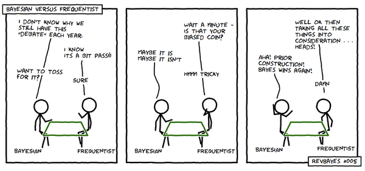

```{r setup, include=FALSE}
knitr::opts_chunk$set(echo = FALSE)
```


```{r,include=FALSE}
library(tidyverse)
library(cowplot)
library(likelihood)
```

## Tutorial 6 
### Content 

- Bootstrapping  
- Probability recap
- Binomial Model
- Normal model
- Parameters
- Frequentists vs. Bayesians

## Bootstrapping
- to do sth *by one's own bootstraps*
    + to do sth by one's own initiative and effort, with little to no assistance

- in statistics
    + idea: we have limited data at hand and we need to put in our own "effort" to get the most out of the data
    + practice: random **re-samples with replacement**


## Bootstrapping    
- specifically for 95% **Confidence Intervals** (e.g. of the mean)
    + vector $D$ with length $k$
    
    <br>
    1. take $k$ samples (**with replacement!**) from $D$, gather them in a vector $D^{rep}$
    2. compute $\mu(D^{rep})$ and add it to the vector $\mu_{sampled}$
    3. repeat 1 and 2
    4. **lower bound** of the 95% CI = **2.5% quantile** of $\mu_{sampled}$
    5. **upper bound** of the 95% CI = **97.5% quantile** of $\mu_{sampled}$


## Probability Recap
- **marginal**: the prob. of one event happening
    + e.g. $P(heads) = \frac{1}{2}, \ P(spades) = \frac{1}{4}$

- **joint**: the prob. of many events happening at the same time
    + if *heads* and *spades* are independent: $P(heads, \ spades) = P(heads) \cdot (spades)$

<br>

- **conditional**: the prob. of an event when you know another event already happened
    + $P(A \ | \ B) = \frac{P(A, \ B)}{P(B)}$
    + e.g. $P(heads) = \frac{1}{2}, \ P(heads \ | \ unfair) = \frac{3}{4}$
    
    
## Bayes' Rule
- $P(\theta \ | \ D) = \frac{P(D \ | \ \theta) \cdot P(\theta)}{P(D)}$

- **rewrite** a certain probability in terms of **other probabilities** that might be much easier to compute
- gain insight into the ***unobservable*** causes of any given observation
    + for data analysis: starting from the **raw data**, gain insight into the (parameters of the) **underlying distribution** that generated the data at hand
    
## Bayes' Rule: Example (if needed)

    
## Binomial
Used to count the number k of successes out of N trials 
 $$P(A) = \binom{N}{k} \cdot p^k(1-p)^{N-k}$$


Three assumptions:
 - only two possible outcomes (success or failure)
 - probability of success is the same for each replication
 - the observations are independent

Mean: $\mu = np$


Standard Deviation: $\sigma=\sqrt{n(p)(1-p)}$

## Example
Each day of a month a student learns 10 new words
Aprox. 10% would be forgotten 
```{r, echo=TRUE}
forgotten <- rbinom(30, 10,.10)
plot(forgotten)
```

## More on Binomial distribution

```{r, echo=TRUE}
### <b>
dens<- dbinom(30, 300, .1) #probability density distribution   
prob <- pbinom(30, 300, .1) #cumulative probability of an event.
quantile<- qbinom(0.54, 300, .1) # takes the probability value and gives a number whose cumulative value matches the probability value
### </b>
round(dens, 3)
round(prob,3)
quantile
```


## Normal

$$P(x) = \frac{1}{\sigma*\sqrt{2\pi}}e^{\frac{-(x-\mu)^2}{2\sigma^2}} $$
 
- mean, median and mode of the distribution coincide
- curve of the distribution is symmetrical about the mean.
- total area under the curve is 1 (as for all continuous distributions).

If $\mu=0$ and $\sigma=1$ It is called standart normal distribution

## Example

```{r, echo=TRUE}
norm <- rnorm(100)
mu<- mean(norm)
median_ <- median(norm)
plot(norm, main=paste("Mean:",round(mu,2), "Median:", round(median_,2) )) 
```

## Density
```{r, echo=TRUE}
dens <-density(norm)
plot(dens, main = "Density of sampled data")
```


## Parameters
- Insert plot grid of standard distributions here
```{r}
sample_size <- 10000
x <- seq(-5, 5, length = sample_size)
normal_dists <- tibble(
    x = x, 
    y_standard = dnorm(x, mean = 0, sd = 1),
    y_shifted = dnorm(x, mean = 3.75, sd = 1),
    y_tight = dnorm(x, mean = 0, sd = 0.5),
    y_wide = dnorm(x, mean = 0, sd = 2),
)
ggplot(data = normal_dists) +
    geom_line(mapping = aes(x = x, y = y_standard)) +
    geom_line(mapping = aes(x = x, y = y_shifted), color = "blue") +
    geom_line(mapping = aes(x = x, y = y_tight), color = "red") +
    geom_line(mapping = aes(x = x, y = y_wide), color = "green")
```
## Sampling

```{r, echo=TRUE}
### <b>
mu <- 100 
sigma <- 15
n_samples <- 10000

simulation <- tibble(sample = 1:n_samples,
                     x = rnorm(n = n_samples, 
                               mean = mu, 
                               sd = sigma))
### </b>
```

## Plot 
```{r, warning= FALSE, message=FALSE}
simulation %>%
  ggplot(aes(x = x)) +
  geom_histogram(binwidth = 1) +
  scale_x_continuous(limits = c(50, 150)) +
  xlab("value") +
  ylab("Frequency") +
  ylim(0,300) +
  theme_classic()
```

## Sampling mean
```{r, warning= FALSE, message=FALSE, echo=TRUE}

sample_size <- 14 
sample_means <- tibble(sample = 1:n_samples,
                           mean = NA,
                           std_dev = NA)

for(i in 1:n_samples){
  sample_values <- rnorm(n = sample_size,
                         mean = mu,
                         sd = sigma)
  sample_means$mean[i] <- mean(sample_values)
}
```

## Plot sampled mean

```{r, message=FALSE, echo=TRUE}
sample_means %>%
  ggplot(aes(mean)) +
  geom_histogram(binwidth = 1) +
 scale_x_continuous(limits = c(50, 150))+
  xlab("Sampled mean") +
  ylab("Frequency") +
  theme_classic()
```


## T-model
- used to compare means of two distrubutions
- both distributions  should come from on family (e.g.normal)
- $\delta$ indicates differencies between the means

## Log likelyhood 
$$\log\prod x_i=log\sum x_i$$


## Which model to use? {.build}

    - if you are intrested how much beer should you buy for a party? 
    
    
    - if you want to check if male height is different among Norh and South Corenians?
    
    
    -  if you want to check whether a new drink increases sense of humor?


    
## Frequentists vs. Bayesians



## 
